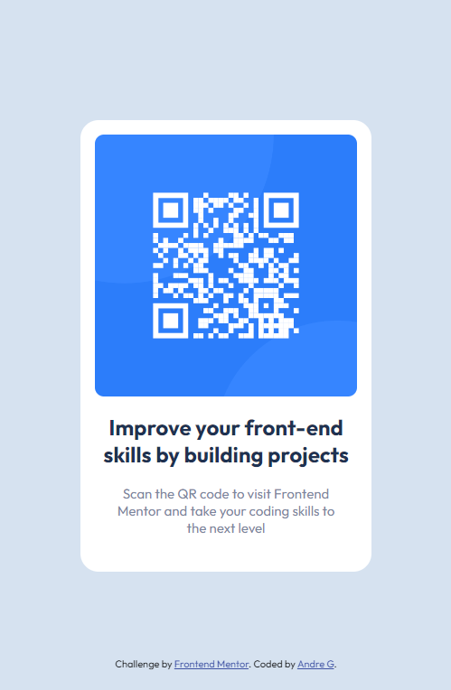

# Frontend Mentor - QR code component solution

This is a solution to the [QR code component challenge on Frontend Mentor](https://www.frontendmentor.io/challenges/qr-code-component-iux_sIO_H). Frontend Mentor challenges help you improve your coding skills by building realistic projects. 

## Table of contents

- [Overview](#overview)
  - [Screenshot](#screenshot)
  - [Links](#links)
- [My process](#my-process)
  - [Built with](#built-with)
  - [What I learned](#what-i-learned)
  - [Continued development](#continued-development)
- [Author](#author)

**Note: Delete this note and update the table of contents based on what sections you keep.**

## Overview

### Screenshot



### Links

- Solution URL: https://github.com/Xephna/qr-code-component-main
- Live Site URL: https://xephna.github.io/qr-code-component-main

## My process

### Built with

- Semantic HTML5 markup
- Flexbox
- Mobile-first workflow

**Note: These are just examples. Delete this note and replace the list above with your own choices**

### What I learned

100vh in body selector allows centering of container using flex, justify content, and align item.

```css
body {
    display: flex;
    justify-content: center;
    align-items: center;
```
### Continued development

Positions, flex, grid needs to be learnt in more detail in future projects.

## Author

- Website - [Add your name here](work-in-progress)
- Frontend Mentor - [@yourusername](https://www.frontendmentor.io/profile/Xephna)
- Twitter - [@yourusername](work-in-progress)
